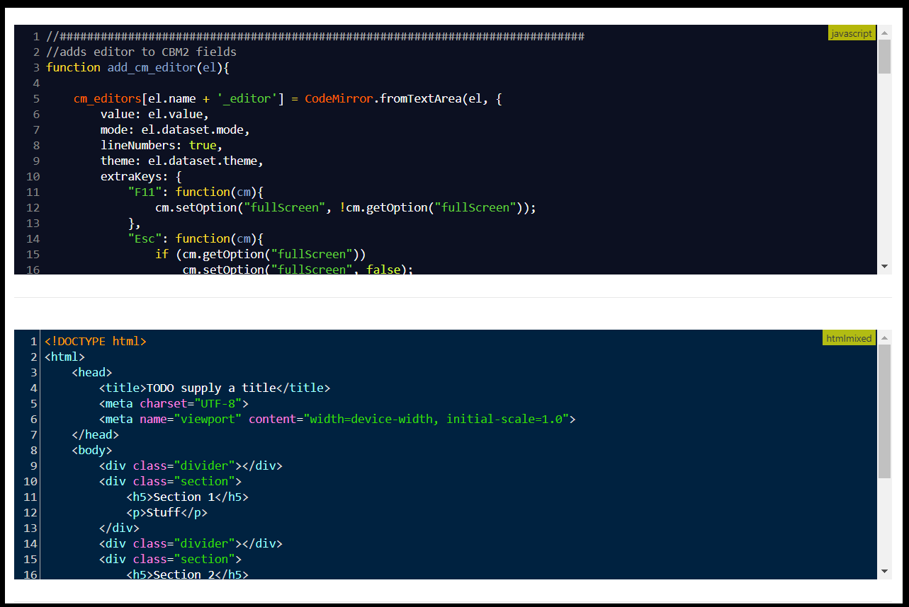
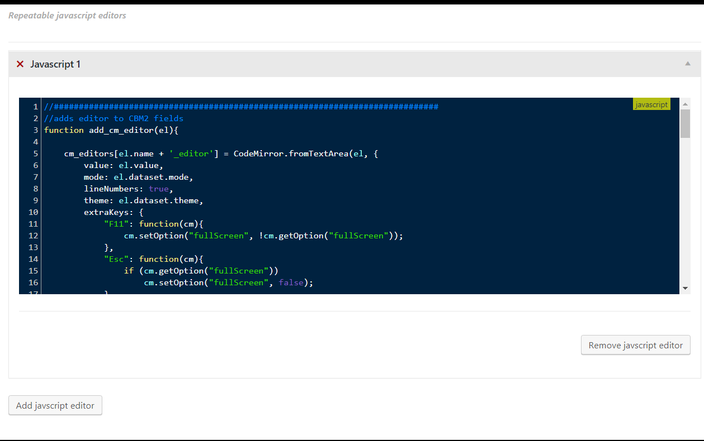
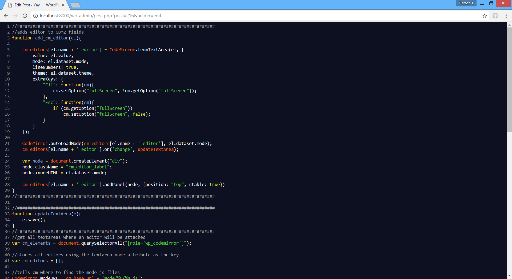

Code editor field for CMB2!
=======================================
CMB2 field / metabox which adds code editor support using the
amazing [CodeMirror project](https://codemirror.net).

## Features
* Syntax highlighing
* Line numbering
* hundreds of languages supported (see: [CodeMirrror supported languages](https://codemirror.net/mode))
* Editor themes(see: [CodeMirror themes](https://codemirror.net/demo/theme.html))
* Inline and repeatable editors
* Full screen support

## Requirements
* Wordpress 4.5 or later
* CMB2 plugin installed and activated

##Screens
### inline editor

### repeatable editor

### editor fullscreen mode
